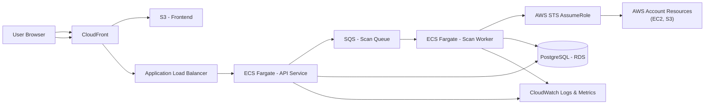

# Architecture & System Design

## TL;DR
This system uses **S3 + CloudFront** to host the frontend, **ECS Fargate** for running the backend API and scanning workers, **SQS** for decoupled scan execution, and **PostgreSQL (RDS)** for storing scan results and audit history.  
AWS **STS AssumeRole** is used to access customer resources securely without persisting long‑lived credentials.

---

## Goals
- Securely analyze AWS resources (EC2, S3) using temporary credentials
- Avoid storing long-lived AWS credentials
- Support scalable, asynchronous scan execution
- Provide clear observability, retries, and failure handling

---

## Key Constraints
- Credentials are provided at runtime and must not be persisted
- Scans may be long-running and resource-intensive
- System should be simple to deploy and reason about
- Design should demonstrate production readiness, not just a PoC

---

## High-Level Architecture
1. The user accesses the frontend hosted on **S3 + CloudFront**
2. The frontend calls the backend API exposed via **ALB**
3. The backend enqueues scan jobs into **SQS**
4. **ECS Fargate workers** consume jobs, assume a cross-account role using **STS**
5. Workers scan AWS resources (EC2/S3) and store results in **Postgres (RDS)**
6. Logs and metrics are published to **CloudWatch**

---

## Architecture Diagram

---

## Component Decisions

### Frontend (S3 + CloudFront)
- Low-cost, highly available static hosting
- Built-in HTTPS and caching
- Simple deployment via CI/CD

### Backend & Workers (ECS Fargate)
- Supports long-running scans and custom libraries
- No server management
- Easy horizontal scaling based on queue depth

### Queue (SQS)
- Decouples API from scan execution
- Provides retries and failure isolation
- Enables controlled concurrency

### Database (PostgreSQL – RDS)
- Relational model fits scan results and audit logs
- Easy querying for reports and history
- Managed backups and maintenance

---

## Security Design
- **STS AssumeRole** for cross-account access
- No persistent storage of AWS credentials
- Least-privilege IAM roles for API and workers
- Network isolation via VPC and security groups

---

## Observability & Operations
- Centralized logs in **CloudWatch**
- Metrics for scan duration, failures, and queue depth
- Alarms on repeated scan failures
- Failed scans can be retried safely from SQS

---

## CI/CD (High Level)
- Pull Request: run tests and lint checks
- Merge to main: build Docker image and push to ECR
- Deploy updated ECS task definitions
- Zero-downtime rolling deployments

---

## Trade-offs & Future Improvements
- **Lambda vs ECS**: ECS chosen for long-running scans; Lambda could be used for lightweight checks
- **RDS vs DynamoDB**: RDS chosen for flexibility; DynamoDB could be used at massive scale
- **ECS vs EKS**: ECS preferred for simplicity; EKS if Kubernetes portability is required
